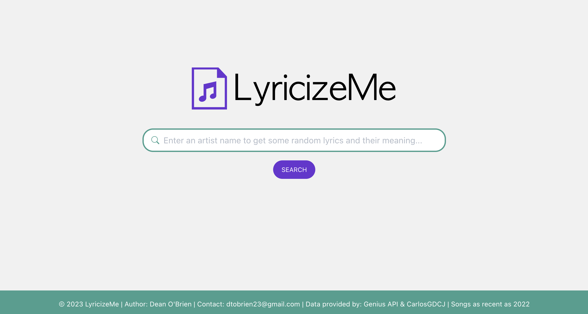
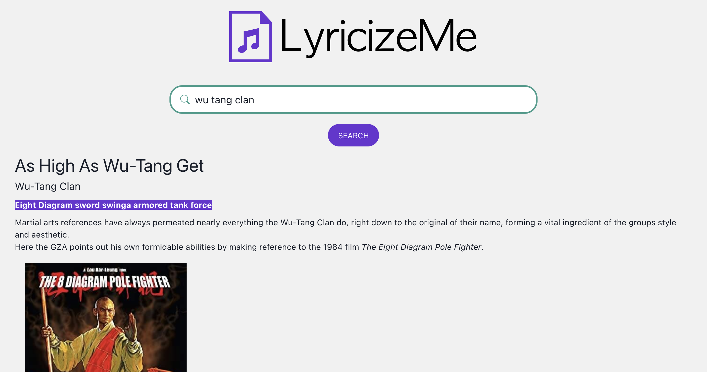

# LyricizeMe
LyricizeMe simplifies the process of exploring an artist's songs. Users simply need to enter the artist's name, and are presented with random song lyrics, annotations, and artist insights, powered by the massive library of song data provided by Genius (https://docs.genius.com/).    
## Data Processing
A comprehensive data set of Genius song data gathered by CarlosGDCJ (https://www.kaggle.com/datasets/carlosgdcj/genius-song-lyrics-with-language-information) was processed to just contain columns with Genius song IDs for each song, and the corresponding artist name - information essential to the functioning of LyricizeMe. An additional column was then added to contain processed artist names, which allows for common user errors or variations in input. This processing included converting to lowercase, replacing '&' with 'and', '$' with 's', removing 'the', and eliminating spaces and punctuation. This data was then stored in a database.
## How It Works
### Frontend (React)
1. Users input the name of an artist in the search bar.
2. The frontend processes the input by transforming it to lowercase, removing special characters, and spaces.
3. It then sends a request to the backend server to retrieve a random lyric and annotation from a random song of the artist.
4. A skeleton screen is displayed while waiting for the backend response.
5. When the response is received, the frontend displays the song title, artist name, lyrics, and annotation. If the artist is not found or there are no annotations for any of the artist's songs, it provides an error message.
### Backend (Python - Flask)
1. The backend receives the artist's name from the frontend as a JSON request.
2. It connects to the database to retrieve a list of songs by the specified artist.
3. If songs are found, it attempts to retrieve lyrics and annotations for a randomly selected song by passing the song ID to the Genius API.
4. It filters out annotations with low votes and provides the song title, artist name, lyrics, and annotation as a JSON response.
5. If no suitable song is found or the artist is not in the database, it returns an error message.
## Contact
If you have any questions or need further information, please contact me via the repository.
